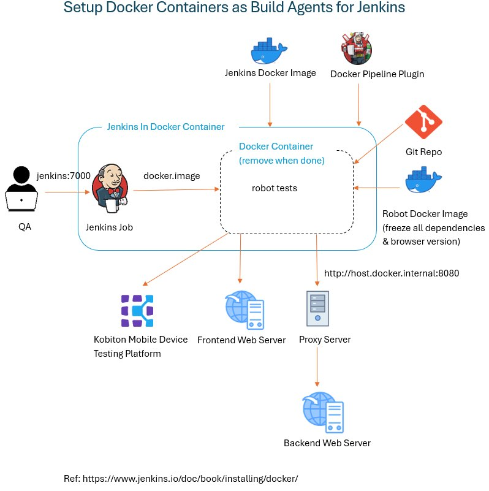

# robot-web
A scalable test automation framework from scratch using RobotFramework (Chrome/Firefox web testing)

## Framework Features
- Run test efficiently using tags
- Work with both normal & shadow DOM
- Data-driven testing with external data sources
- Integrate automation tests into Jenkins for CI/CD pipelines

## Requirements
- Python 3.9.0
- Selenium 3.141.0

## Environment Setup
- Install the packages
```commandline
python -m venv venv && venv\Scripts\activate.bat
pip install -r requirements.txt
pre-commit install
```
- Download the latest Chrome/Firefox driver and put it in the directory `PYTHON_HOME\Scripts`

## Run tests and generate reports

- Sequential option
```commandline
robot --pythonpath . -d results tests\luma\order_creation.robot
robot --pythonpath . -d results -i order tests
robot --pythonpath . -d results -i extensions tests
robot --pythonpath . -d results -i upload tests
```

- BROWSER run option, default is Chrome
```commandline
robot --pythonpath . -d results -i order tests
robot --pythonpath . -d results -i order -v BROWSER:Firefox tests
```
ref: https://robotframework.org/robotframework/latest/RobotFrameworkUserGuide.html#setting-variables-in-command-line

## View reports
After run, open results\log.html by browser to view result

## Debug test
Use the snippet below
```commandline
import sys, pdb; pdb.Pdb(stdout=sys.__stdout__).set_trace()
```
ref: https://robotframework.org/robotframework/latest/RobotFrameworkUserGuide.html#using-the-python-debugger-pdb

## Limitations
- EdgeOptions got introduced with Selenium v4.0 - https://forum.robotframework.org/t/robot-framework-test-on-edge/6366/17

## Build up Jenkins server
- Architecture


- Start Jenkins at the first time
```commandline
cd jenkins
docker-compose build
docker-compose up -d
```

## Project Structure
https://docs.robotframework.org/docs/examples/project_structure

Root Folder
- .gitignore - Lists files and folders to be ignored by git
- .pre-commit-config.yaml - A pre-commit config that will run Robot Framework's Tidy tool on all of your robot files
- .pre-commit-hooks.yaml
- README.md - Project description
- requirements.txt - Python dependencies

Test Suites
- tests/ - Test Suites folder
    + e2e/luma/order_creation.robot - End to End Test Suite for order creation on Luma site/system
    + funtional/checkout/checkout_basic.robot - Functional Test Suites for standard Checkout
    + funtional/checkout/checkout_premium.robot - Functional Test Suites for premium Checkout
    + funtional/csm/upload_file.robot - Functional Test Suite for Upload functionality on CSM site/system
    + funtional/extension/add_shortcut.robot - Functional Test Suite for Add Shortcut functionality on Chrome extension site

Resources
- resources/ - Reusable keywords
    + keywords/common.robot - General Keywords (e.g. Login/Logout, Navigation, ...) are stored here
    + keywords/csm.robot - Keywords for CSM system are stored here
    + keywords/extension.robot - Keywords for Chrome extension are stored here
    + keywords/luma.robot - Keywords for Luma system are stored here
    + locators/csm.robot - Locators for CSM system are stored here
    + locators/extension.robot - Locators for Chrome extension are stored here
    + locators/luma.robot - Locators for Luma system are stored here
    + settings/csm.robot - Settings for CSM system are stored here
    + settings/extension.robot - Settings for Chrome extension are stored here
    + settings/luma.robot - Settings for Luma system are stored here

Libraries
- libraries/ - Custom Python Keyword libraries
    + csv_dao.py - CSV Data Access Object
    + csv_keywords.py - Custom keywords for reading/updating CSV

Data
- data_variables/ - https://docs.robotframework.org/docs/variables
    + csm/config.py - CSM Config are stored here
    + csm/SampleJPGImage_2mbmb.jpg - Image is used for testing
    + extension/config.py - Extension Config are stored here
    + luma/config.py - Luma Config are stored here
    + luma/customer.csv - Data is used for testing
    + common_config.py - General Config are stored here

Jenkins Server
- jenkins/ - Folder containing docker file for building up Jenkins server
    + images/ - Folder containing docker file for building up a custom docker image which is used in Jenkinsfile for running test
    + docker-compose.yml
    + Dockerfile
    + Jenkinsfile - Jenkinsfile to run test
